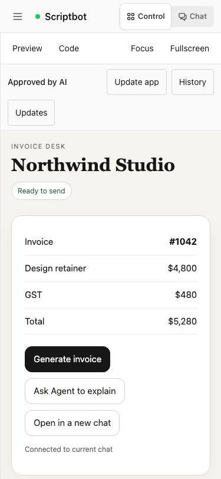
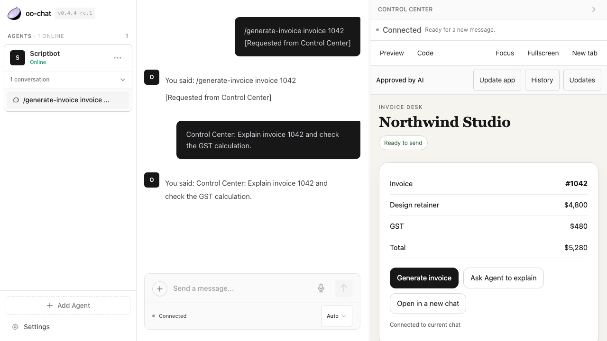
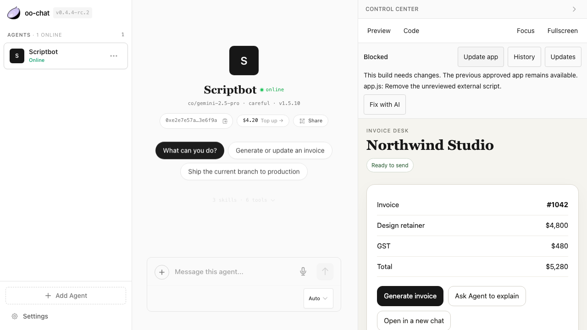

# Full Web Control Center

O Chat renders a complete static app after the authenticated Host supplies a reviewed
immutable HTTPS revision. Legacy dashboard HTML remains a separate inert snapshot;
it cannot opt into full-app execution by embedding descriptor-shaped JSON.

## Parent connection and app bridge

The parent owns `useAgentForHuman`, identity, authentication, reconnect and transcript.
It passes the SDK's normalized ChatItems/status/connection/skills/session into
`createControlCenterHost`. `boundControlSnapshot` limits recent complete items and
marks truncation. Ordered updates use that same connection and request a new snapshot
if the iframe misses a sequence number. No identity keys enter the app.

A child uses `connectControlCenter` from `@connectonion/react/control-center/browser`.
O Chat supplies the parent origin and revision in the iframe URL fragment. A handshake
checks the source window, exact origin, protocol, revision and fresh load epoch before
transferring one MessagePort. Reload/revision change closes the old port and cancels
pending actions. A bare static URL has no conversation identity.

```ts
const client = await connectControlCenter({parentOrigin, revision});
client.subscribe(snapshot => render(snapshot.chatItems));
await client.sendMessage('Explain the current invoice.');
await client.runSkill('generate-invoice', 'invoice 1042', {signal});
```

Both actions appear visibly attributed in Chat. Current conversation is the default;
the landing page promotes its draft on first action. Only an explicit
`conversation: 'new'` option creates another conversation. Current-chat actions start
only when the Agent is idle and wait for completion. Cancellation reaches only the
pending owned turn; a new-chat navigation acknowledges its handoff. Timeout messages
ask the caller to inspect Chat before retrying. Skill actions require a published
skill, and existing Host permissions still govern the resulting work.

## Review controls

`CONTROL_CENTER_STATE` carries active revision, attempts/findings and update status.
`CONTROL_CENTER_APP` remains compatible with descriptor-only Hosts. Both are accepted
only on an authenticated current session. An explicit unavailable state clears the
active app; malformed data cannot replace it.

The Control Center offers Preview/Code, bounded current and retained source, diffs,
review status/findings, History/Restore, Fix with AI and update settings. Commands use
signed correlated `CONTROL_CENTER_COMMAND` frames through the existing SDK transport.
Only the Host administrator can author/configure/read source or roll back; the Host
is authoritative and reports access failures. A blocked update leaves the previous
approved iframe visible. Review approval describes an automated check, not a guarantee.

Automatic updates are disabled by default. An administrator can choose an interval
or daily time/timezone and subscribe to internal completed-turn, explicit-skill and
source-change events. The Host coalesces events, applies single-writer and daily
attempt/cost limits, and exposes next run, last attempt/success and errors. Interrupted
updates require manual retry. Mail/provider scheduling is outside this feature.

## Browser and layout boundary

The iframe is a normal HTTPS document. O Chat rejects its own origin, known product
and identity cookie domains, URL credentials/query/fragment, invalid revisions and
unsupported schemas/capabilities. Operators of custom hosts must provision a separate
registrable serving domain. The upload/static services enforce immutable per-account,
per-app, per-revision origins, and the static service has no identity/API routes.

The serving CSP permits local executable assets, normal data networking, storage,
workers, canvas/SVG/WebGL and WASM. It blocks external script loading and string eval.
Declared permissions become the iframe `allow` policy; browser grants still apply.
Neither the app nor its public assets receive ambient O Chat credentials.

Focus and fullscreen preserve the iframe. New tab opens the current O Chat session
route with a revision pin, restores its conversation and establishes its own parent
SDK connection. A newer approved revision produces an explicit mismatch choice.
The parent supplies loading, error and retry states; stale frames cannot act.

## Candidate verification

The coordinated local candidate was built with a packed React SDK. Focused port and
Host tests cover replay, scope, cancellation, integrity, reviews, rollback and queued
updates. The browser fixture is a complete cross-origin invoice app using the SDK and
the static host's CSP. It exercises current/new chat, normalized updates, mobile,
focus, Code/diff, blocked review, persisted settings, rollback, Relay-only/fallback,
and new-tab/reload restoration. Synthetic provider traffic is not a production
hosting or external-model acceptance claim.

Use the paired SDK artifact when running this branch, then:

```bash
npm test
npx tsc --noEmit
npx next build --webpack
E2E_BASE_URL=http://127.0.0.1:3184 E2E_SHOTS_DIR=/tmp/frontend-test-screenshots \
  npx playwright test e2e/control-center-app.spec.ts --project chromium
```

Next's default Turbopack build hit a local helper-port restriction; the production
Webpack build passed. Screenshots and measurements accompany the candidate acceptance
record. No deployment or SDK package publication is performed by these checks.







The repository's required continuous `e2e/pr-evidence.spec.ts` journey also passes
against this production build: invite acceptance, prompt, read-only/full-access
acknowledgements and the legacy dashboard update in one session. Its fixture still
uses the historical “Release 1.7” label; it is compatibility evidence, separate from
the nine full-app cases above. See `docs/assets/control-center/required-journey.png`.

For local candidate validation, first build and pack React PR #103 at `d8e229a`.
After this repository's `npm ci`, extract that package into
`node_modules/@connectonion/react` (do not rewrite the dependency lock). Recorded
tarball SHA-256: `a383f6b1b2468d6c3a85b7ab37c40e5d20c44f579258f403e3cdb6c03e2b9539`.
This candidate does not publish the SDK. A normal registry-based deployment still needs
that coordinated SDK publication and a reviewed dependency update.
