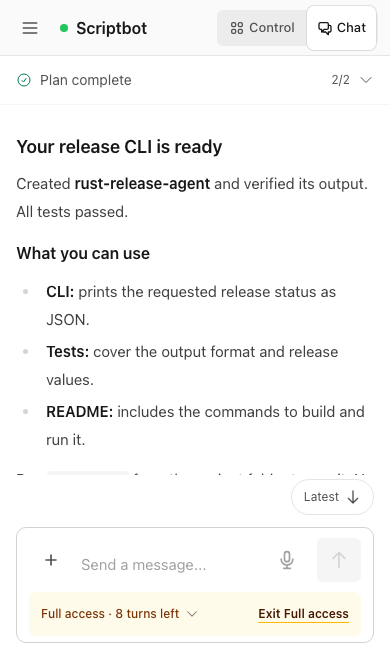

# 对话界面拥挤问题：批评、修复与复审

2026-09-26 · 关联 [UI issue #253](https://github.com/openonion/oo-chat/issues/253) / [PR #251](https://github.com/openonion/oo-chat/pull/251)

## 更正之前的验收结论

此前把功能测试、输入区边界检查和截图检查合称为“视觉验收通过”，结论过宽。它没有证明页面的阅读顺序和信息密度合格。用户指出拥挤后，两名独立 **AI 设计审查者** 实际检查旧版截图，都要求修改；不存在外部或人类设计师的认可。

这次把功能验证与设计审查分别记录。最终两名审查者均通过了下述截图场景；这不表示全产品的设计已经完成。

## 最大的五个问题与对应改动

| 问题 | 修改 |
| --- | --- |
| 手机完成清单常驻两张大卡，占去正文高度 | 默认一行计划状态和进度；展开才显示完整任务、状态、优先级。 |
| 桌面默认三栏争夺注意力，会话被不相关的控制面板挤窄 | 会话默认专注聊天；顶部有明确的 Control Center 入口，仍可展开、调整宽度。 |
| Full access 黑色横条与输入区重复，技术统计也持续占位 | 权限、剩余轮数、明确的退出动作放在输入区同一条浅琥珀色区域；用量移入可展开详情。 |
| 工具流水先于结果，大量完成记录挤压正文 | 连续成功步骤在收到结果后折叠。失败、运行、审批保持可见；正在回看记录的用户保留展开状态。 |
| Work Room 先展示长请求和过程，再展示结果 | 完成态先给最新结果；原请求、早期对话、执行详情分别可展开，权限选择明确标注用途。 |

此外，手机正文去掉重复头像带来的缩进，保持原字号。长结果完成时从结果开头阅读；同一消息逐渐变长时只调整一次。用户读历史时不自动拉回；发送新消息后恢复跟随。

## 同内容、同尺寸对比

以下是生产构建中的脚本 Agent 内容，不含真实用户数据。旧版代码为 `6ba8b418d58c19d627f7ee2b39d782cdf8e470dc`，使用相同场景重新捕获；布局没有通过裁剪图片修改。

| 场景 | 之前 | 之后 |
| --- | --- | --- |
| 短屏手机 390×667 | [查看](e2e-evidence/ui-density/before-chat-390x667.png) | [查看](e2e-evidence/ui-density/after-chat-390x667.png) |
| 手机 390×844 | [查看](e2e-evidence/ui-density/before-chat-390x844.png) | [查看](e2e-evidence/ui-density/after-chat-390x844.png) |
| 平板 768×1024 | [查看](e2e-evidence/ui-density/before-chat-768x1024.png) | [查看](e2e-evidence/ui-density/after-chat-768x1024.png) |
| 桌面 1440×900 | [查看](e2e-evidence/ui-density/before-chat-1440x900.png) | [查看](e2e-evidence/ui-density/after-chat-1440x900.png) |
| 手机 Work Room | [查看](e2e-evidence/ui-density/before-workroom-390.png) | [查看](e2e-evidence/ui-density/after-workroom-390.png) |
| 桌面 Work Room | [查看](e2e-evidence/ui-density/before-workroom-1440.png) | [查看](e2e-evidence/ui-density/after-workroom-1440.png) |

### 手机修复后

## 四轮独立批评记录

审查者：`design_audit`、`source_audit`，均为独立 AI 审查代理。每轮先打开截图，再给结论；以下为意见摘要。

| 轮次 | 结论 | 主要批评与后续处理 |
| --- | --- | --- |
| 1 | 两名均要求修改 | 短屏标题在屏外；`8 left / Exit` 不够清楚；Work Room 仍先显示过程和请求。修正文宽度、权限文案和结果顺序。工具场景的完成事件写错也在这轮修正，没有将错误截图当作通过证据。 |
| 2 | 主聊天要求修改；Work Room 层级接近/达到通过 | [短屏仍从结果中段开始](e2e-evidence/ui-density/round2-rejected-phone.png)。改完成结果的阅读落点；给 Provider permissions 加明确标签，早期对话增加展开/收回反馈。 |
| 3 | 一名通过目标布局；另一名仍要求修改 | [居中向下箭头盖住正文](e2e-evidence/ui-density/round3-rejected-overlay.png)。移至正文之外的底边行。另一位提出同 ID 流式内容变长的风险，补充 ResizeObserver 处理和浏览器回归。 |
| 4 | 两名均通过本轮场景 | 标题、结论和权限退出在短屏可见；Latest 不遮正文；Work Room 结果优先。同 ID 渐长、回看历史、新消息跟随分别验证。 |

[同 ID 渐长结果截图](e2e-evidence/ui-density/after-streamed-result-390.png)。这次回归还发现自动折叠会打断正在看历史的用户，已修为该组保持展开。

`source_audit` 另行查看了完整回归生成的[手机审批](e2e-evidence/ui-density/approval-phone.png)和[语音失败恢复](e2e-evidence/ui-density/voice-denied-phone.png)，两者通过：审批作用范围、主按钮可读，错误提示没有遮挡保留的草稿或发送操作。

## 验证与范围

- `e2e/density-review.spec.ts`：四种会话尺寸、两种 Work Room 尺寸、同 ID 渐长结果；同时验证计划/步骤/原请求展开、Full access 退出、Control Center 开关。
- `e2e/scroll-follow.spec.ts`：流式跟随、读历史不被拉回、发送新消息恢复跟随、跳转按钮不覆盖正文。
- `components/chat/completed-activity.test.ts`：成功记录可追溯，未产出结果、运行和失败记录不被隐藏。
- 211 个单元测试通过；production build 通过；lint 无错误，保留七个已有警告。完整 E2E 结果在 PR 的当前提交验证中记录。
- 完整 Chromium 回归首次 231 项通过，三项失败：旧权限文案断言、像素采样碰到代码文字、已不再使用的横条仍有导出。修正断言与采样位置、删除失效组件后，三项均复验通过。没有把首次运行写成全绿。
- 本轮证据为浏览器中的确定性场景。此前真实 Core/Provider 验收对应旧提交，不能冒充新提交的真实 Host 验收。

剩余非阻断意见：计划与步骤仍是两个轻量入口；侧栏 SDK 版本权重可继续降低。短屏长文仍需滚动，但关键结论应先出现。Control Center 的内容相关性继续由相关后端 issue 跟进。

## 固化到工作方式

产品设计 skill 要求每轮有意义的截图都交给独立审查者；记录“批评 → 修改 → 复审”。浏览器验证 skill 单独报告行为验证与设计结论。重要设计意见未解决时必须写“需修改”，不能因为自动化全绿而放行。
